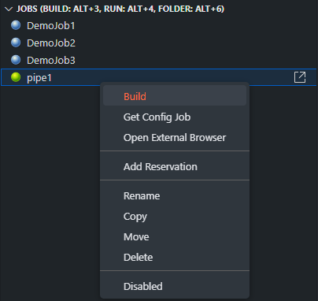
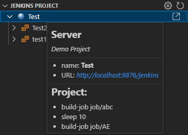
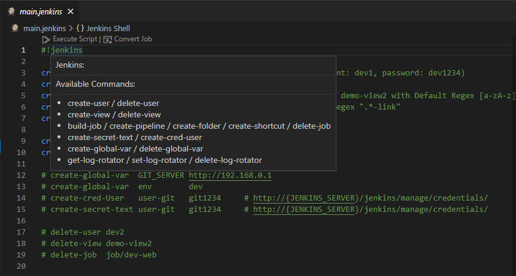

# Jenkins Suite for Visual Studio Code

[](https://marketplace.visualstudio.com/items?itemName=utocode.jenkinssuite)
[](https://marketplace.visualstudio.com/items?itemName=utocode.jenkinssuite)
[](https://github.com/utocode/jenkins-suite/blob/master/LICENSE)

This extension is built to make Jenkins fast to accomplish many tasks within VS Code. You can create a view that can be used in Jenkins, or you can change the name of the view. It also allows you to create, modify, and build the most important tasks. One of the most important things is to do most of the work with shortcuts to save time.

For more information, please visit the following site.

**[https://jenkinssuite.github.io/](https://jenkinssuite.github.io/categories/en)**

## Prerequisites

* Install Jenkins
* Install Jenkins Plugins [Recommend]
  * JobDSL: [https://plugins.jenkins.io/job-dsl/](https://plugins.jenkins.io/job-dsl/)
  * CategorizedView: [https://plugins.jenkins.io/categorized-view/](https://plugins.jenkins.io/categorized-view/)
  * WsTalk: Communicate build information from the jenkins server via websockets [https://github.com/utocode/wstalk/releases/](https://github.com/utocode/wstalk/releases/)
* Make User of the Jenkins (Account & API Token)

## Features

* Connection [SwitchConnection (Alt+1)]
  * Connect / Disconnect
  * Connect SSH / Connect SSH with External
  * Create User / Set Default / Change Executor / Create Secret Text / Create Username with password / System Message

  

* View [SwitchView (Alt+2)]
  * List
  * Create or Config View

  

* Job [SwitchBuild (Alt+3) RunJob (Alt+4) RunFolder (Alt+6)]

  * List / Create / Build
  * __Add Reservation__
  * Rename / Copy / Move / Delete / Copy URI / Enabled / Disabled
  * Configuration: Create or Update
  * Open Job in Web Browser

  

* Build History [SwitchBuild (Alt+5)]
  * View Console Log
  * Open Log in Web Browser

  

* __Reservation__ [Add Schedule (Alt+7), Add Multi Schedule (Alt+8)]

* Generate Job Code (Ctrl+Alt+Insert)

  

* Generate Custom Code (Ctrl+Shift+Insert)

  

* Validate Jenkinsfiles (Ctrl+Alt+T)

  

* Add Jenkins Project View of the Explorer

  

* Use __Jenkins Shell Mode__

  

## Getting Started

* Generate an API Token
  * Log in to the Jenkins instance
  * Click on “Manage Jenkins” in the Jenkins dashboard
  * Click on the “Manage Users“
  * Select the user we want to generate an API token for and click on their name to access their user configuration page
  * Generate a token using the “Add new token” section of the user configuration page
  * Click on the “Copy” button to copy the token to the clipboard
  * Save the configurations

  

* Open the settings of the VS Code
* Find "Servers" of the Jenkins Suite Extensions
* Edit in settings.json

## Extension Settings

* Add Jenkins Server

```json
  "jenkinssuite.servers": {
    "local": {
      "url": "http://localhost:8080/jenkins",
      "description": "Local Server",
      "username": "admin",
      "token": "__YOUR TOKEN__",
      "ssh": {
        "enabled": false,
        "address": "192.168.0.1",
        "port": 22,
        "username": "root",
        "externalPath": "putty.exe",
        "externalArg": "-P"
      },
      "wstalk": {
        "enabled": false,
        "url": "ws://localhost:9090/jenkins",
        "description": "WsTalk for Local Server"
      }
    },
    "test": {
      "url": "http://localhost:8080/jenkins",
      "description": "Test Server",
      "username": "admin",
      "token": "__YOUR TOKEN__",
      "ssh": {
        "enabled": false,
        "address": "192.168.0.1",
        "port": 22,
        "username": "root",
        "externalPath": "putty.exe",
        "externalArg": "-P"
      },
      "wstalk": {
        "enabled": false,
        "url": "ws://localhost:9090/jenkins",
        "description": "WsTalk for Test Server"
      }
    }
  }
```

## Jenkins Project Tree View of Explorer

* You can run a job related to the folder of the current project inside Visual Studio Code.
* Create a .jenkinsrc.json file in your project directory

**.jenkinsrc.json** file

```json
{
  "local": {
    "applications": [
      "job/demo1",
      "job/demo2"
    ],
    "buildProject": [
      "build-job job/demo1",
      "sleep 30",
      "build-job job/demo2"
    ],
    "description": "Demo Project"
  }
}
```

## Jenkins Batch Script

* Change _Jenkins Shell_ [JKSSH] Language Mode after editor open
* The script file must start with __"#!jenkins"__

```sh
#!jenkins

create-user     dev1 dev1234                # create user (account: dev1, password: dev1234)
create-user     dev2 dev1234                # create user
create-views    demo-view1 demo-view2       # create demo-view1, demo-view2 with Default Regex [a-zA-z].*
create-view     link-view1 .*-link          # create View with regex ".*-link"
create-folder   my-folder                   # create folder

create-pipeline dev-web
create-shortcut home-link  https://jenkinssuite.github.io

# create-global-var  GIT_SERVER http://192.168.0.1
# create-global-var  env        dev
# create-cred-User   user-git   git1234     # http://{JENKINS_SERVER}/jenkins/manage/credentials/
# create-secret-text user-git   git1234     # http://{JENKINS_SERVER}/jenkins/manage/credentials/

# delete-user dev2
# delete-view demo-view2
# delete-job  job/dev-web
```

## Issues

Please let me know of any bugs via the issues page

## Release Notes

See [CHANGELOG.md](CHANGELOG.md)

## License

See [LICENSE](LICENSE) for more information.
