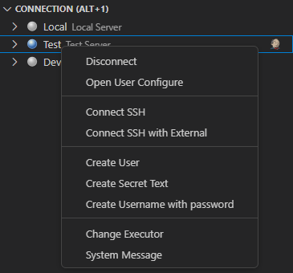

# Jenkins Suite

Jenkins Extension for Visual Studio Code

* 한글 문서 [한글문서](README_KO.md)

## Prerequisites

* Install Jenkins
* Install Jenkins Plugins [Recommend]
  * JobDSL: <https://plugins.jenkins.io/job-dsl/>
  * CategorizedView: <https://plugins.jenkins.io/categorized-view/>
  * WsTalk: Communicate build information from the server via websockets [Working to publish]
    * Download: <https://github.com/utocode/wstalk/releases/>
* Make User of the Jenkins (Account & API Token)

## Features

- Connection [SwitchConnection (Alt+1)]
  - connect / disconnect

  

- View [SwitchView (Alt+2)]
  - List
  - Create View

  

- Job [SwitchBuild (Alt+3) RunJob (Alt+4) RunFolder (Alt+6)]

  - Job: List / Create / Build
  - Configuration: Get / Update
  - Open Job in Web Browser

  

- Build History [SwitchBuild (Alt+5)]
  - View Log
  - Open Log in Web Browser

  

- Generate Job Code (Ctrl+Alt+Insert)

  

* Generate Code From Snippet

  


- Validate Jenkinsfiles (Ctrl+Alt+t)

  


# Getting Started

* Generate an API Token
  * Log in to the Jenkins instance
  * Click on “Manage Jenkins” in the Jenkins dashboard
  * Click on the “Manage Users“
  * Select the user we want to generate an API token for and click on their name to access their user configuration page
  * Generate a token using the “Add new token” section of the user configuration page
  * Click on the “Copy” button to copy the token to the clipboard
  * Save the configurations

  

* Open the settings of the VS Code
* Find "Servers" of the Jenkins Suite Extensions
* Edit in settings.json

## Extension Settings

+ Add Jenkins Server

```json
  "jenkinssuite.servers": {
    "local": {
      "url": "http://localhost:8080/jenkins",
      "description": "Local Server",
      "username": "admin",
      "token": "__YOUR TOKEN__",
      "wstalk": {
        "enabled": false,
        "url": "ws://localhost:9090/jenkins",
        "description": "WsTalk for Local Server"
      }
    },
    "test": {
      "url": "http://localhost:8080/jenkins",
      "description": "Test Server",
      "username": "admin",
      "token": "__YOUR TOKEN__",
      "wstalk": {
        "enabled": false,
        "url": "ws://localhost:9090/jenkins",
        "description": "WsTalk for Test Server"
      }
    }
  }
```

## Issues

Please let me know of any bugs via the issues page!

## Release Notes

See [CHANGELOG.md](CHANGELOG.md)
