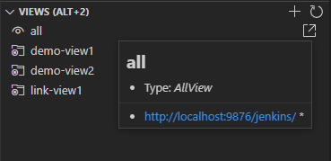

# Jenkins Suite

VS Code에서 가능하면 마우스 없이 빠른 일을 하기 위해 개발하였습니다.
개발 / 스테이징 / 운영환경 처럼 분리된 서버를 전환하며 View >> Job (혹은 Folder) 를 쉽게 선택하며 빌드 / 로그를 쉽게 볼 수 있도록 하였습니다.
주요한 단축키는 Alt+1 ~ Alt+6, Ctrl+Alt+Insert (Generate Job Code), Shift+Alt+Enter (Job 실행/업데이트) 를 사용하시면 편한 작업이 가능합니다.

## Prerequisites

* Install Jenkins
* Install Jenkins Plugins [추천]
  * JobDSL: <https://plugins.jenkins.io/job-dsl/>
  * CategorizedView: <https://plugins.jenkins.io/categorized-view/>
  * WsTalk: Jenkins Server에서 빌드된 정보를 알림 [Notify]
    * Download: <https://github.com/utocode/wstalk/releases/>
* Make User of the Jenkins (Account & API Token)

## Features

- Connection [서버 전환 (Alt+1)]
  - connect / disconnect

  

- View [View 전환 (Alt+2)]
  - List
  - Create View

  

- Job [Job 전환 (Alt+3) Job 실행 (Alt+4) Job 실행 in Folder (Alt+6)]

  - Job: List / Create / Build
  - Configuration: Get / Update
  - Open Job in Web Browser

  

- Build History [빌드 기록 (Alt+5)]
  - View Log
  - Open Log in Web Browser

  

- Generate Job Code (Ctrl+Alt+Insert)

  

* Generate Code From Snippet

  


- Validate Jenkinsfiles (Ctrl+Alt+t)

  


# Getting Started

* Jenkins 서버에서 API Token 생성
  * Jenkins 서버 로그인합니다.
  * Dashboard 화면에서 "사람" 선택합니다.
  * 사용자 화면에서 자신의 계정을 선택합니다.
  * 좌측 패널에서 "설정" 버튼을 선택합니다.
  * API Token 에서 "ADD NEW TOKEN"를 선택하고 Generate 버튼을 선택합니다.
  * 복사 버튼을 선택하거나 생성된 Token을 복사합니다.
  * 하단의 Save 버튼을 선택합니다.

  

* VS Code 를 실행합니다.
* Settings (Ctrl + .) 화면을 실행합니다.
* Extensions >> Jenkins Suite >> Servers (Jenkins Configuration) 하단의 "Edit in settings.json" 를 선택합니다.
* 접속해야 할 서버 정보를 생성하고 저장합니다.

## Extension Settings

+ Add Jenkins Server

```json
  "jenkinssuite.servers": {
    "local": {
      "url": "http://localhost:8080/jenkins",
      "description": "Local Server",
      "username": "admin",
      "token": "__YOUR TOKEN__",
      "ssh": {
        "enabled": false,
        "address": "192.168.0.1",
        "port": 22,
        "username": "root",
        "externalPath": "putty.exe"
      },
      "wstalk": {
        "enabled": false,
        "url": "ws://localhost:9090/jenkins",
        "description": "WsTalk for Local Server"
      }
    },
    "test": {
      "url": "http://localhost:8080/jenkins",
      "description": "Test Server",
      "username": "admin",
      "token": "__YOUR TOKEN__",
      "ssh": {
        "enabled": false,
        "address": "192.168.0.1",
        "port": 22,
        "username": "root",
        "externalPath": "putty.exe"
      },
      "wstalk": {
        "enabled": false,
        "url": "ws://localhost:9090/jenkins",
        "description": "WsTalk for Test Server"
      }
    }
  }
```

### Severs 정보 설명

```json
  "jenkinssuite.servers": {
    "local": {                                   # 서버 이름
      "url": "http://localhost:8080/jenkins",    # 접속해야 할 URL
      "description": "Local Server",             # "local" 에 대한 설명
      "username": "admin",                       # 접속 계정
      "token": "__YOUR TOKEN__",                 # API Token
      "ssh": {                                   # SSH 서버
        "enabled": false,                        # SSH 사용 여부
        "address": "192.168.0.1",                # 접속할 SSH 서버
        "port": 22,                              # SSH 포트번호
        "username": "root",                      # SSH 계정
        "externalPath": "putty.exe",             # SSH 외부 프로그램
        "externalArg": "-P"                      # SSH 외부 프로그램의 Argument
      },
      "wstalk": {                                # WsTalk plugin 설치 필요
        "enabled": false,                        # 사용 여부
        "url": "ws://localhost:9090/jenkins",    # URL. port (9090), prefix (/jenkins: [수정 불가])
        "description": "WsTalk for Local Server" # 서버 설명
      }
    }
  }
```

## Issues

Please let me know of any bugs via the issues page!

## Release Notes

See [CHANGELOG.md](CHANGELOG.md)
